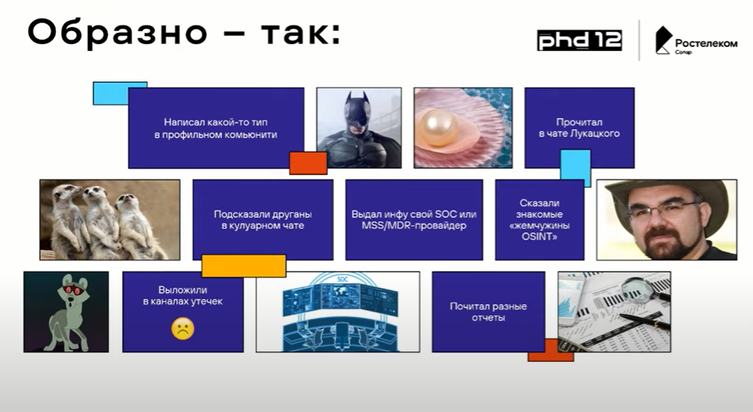
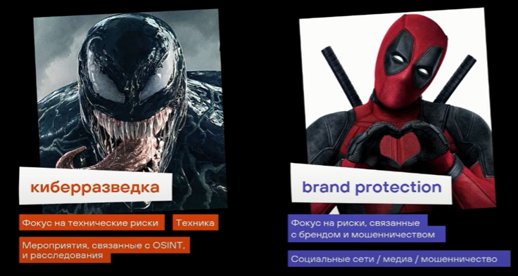
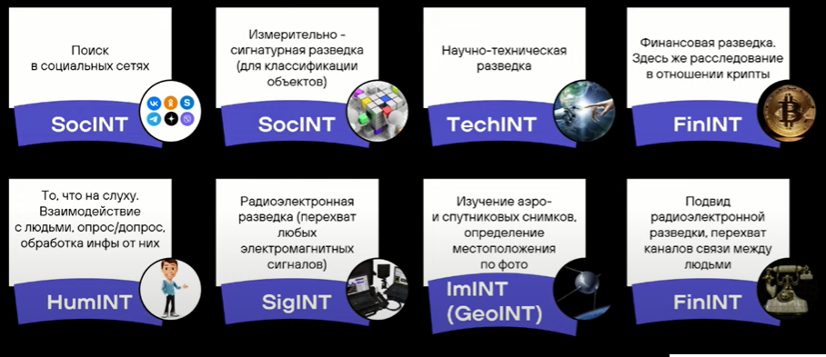
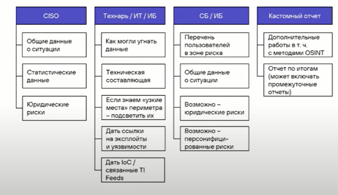

<!DOCTYPE html>
<html >
<head>
    <meta charset="UTF-8">
    <title>Lab 7 Rozanseva</title>
	<link rel="stylesheet" href="main.css">
</head>
<body>
	
   <h1>Доклад с форума PHD12 >>> Киберразведка — это просто, и чем она отличается от «пробива», OSINT и HUMINT</h1>
   
   <h2>Дмитрий Махаев «Ростелеком-Солар»</h3>
   

   	<h3>Как сейчас получаем информацию о готовящихся и прошедших атаках?</h3>
   	
   

   

   	<h3 class="problem">В чем проблема такого подхода?</h3>
   	<ul>
   		<li>Возможная неполнота информации:  SOC даст технические данные, но может не дать контекста для принятия решения</li>
   		<li>Малое время на возможную подготовку к атаке</li>
   		<li>Невозможность предугадать, как именно будет производиться атака</li>
   		<li>Возможное искажение информации или субъективная интерпритация</li>
   	</ul>
   

   

   	<h3 class="osint">Что есть OSINT?</h3>
   	
 - Сбор информации о человеке или организации из открытых источников и ее последующий  
Разведка на основе открытых данных активно применялась еще во время Второй мировой войны в Британии и США: специальные подразделения мониторили трансляции противника.  В настоящее время методы OSINT используются не только во внешней политике, но и в сфере информационной безопасности.

   

   

   	<h3 class="osint">КИБЕРРАЗВЕТКА = BRAND PROTECTION</h3>
   	
   

   

   	<h3>Направления OSINT</h3>
   	
   

	

		<h3>Что писать в отчет?</h3>
		
В первую очередь, нужно определить конечных получателей отчета. Универсального отчета быть не может

		
	

</body>
</html>
